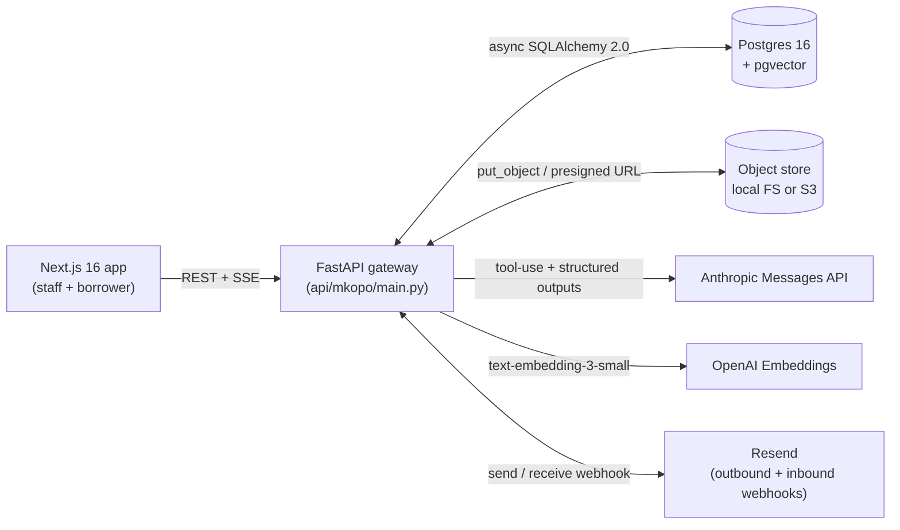
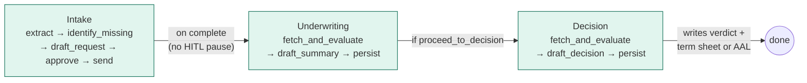
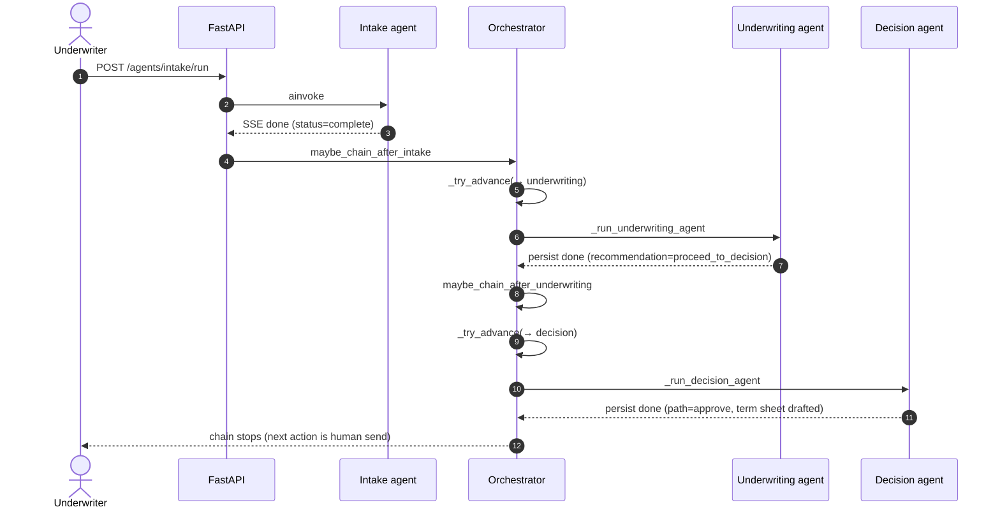
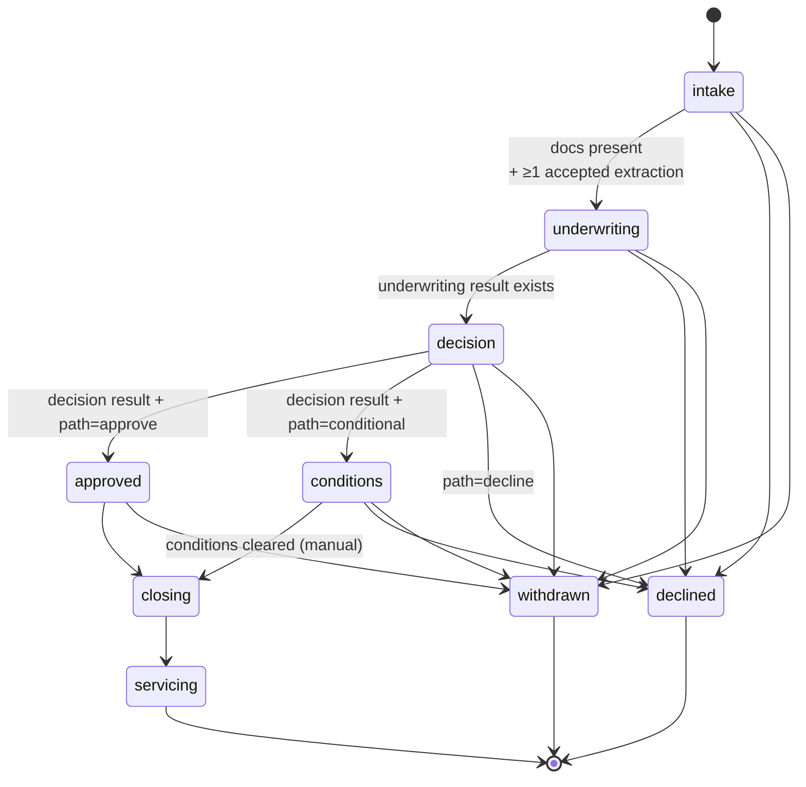
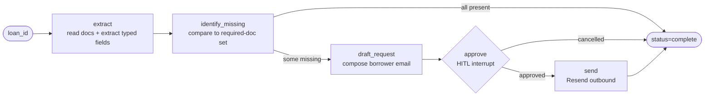
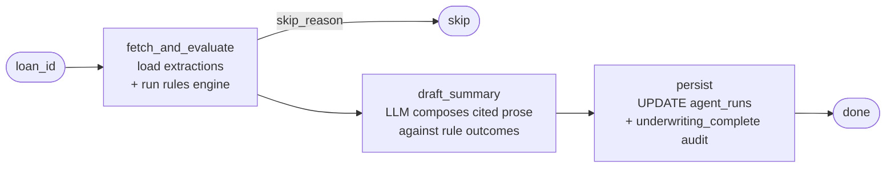
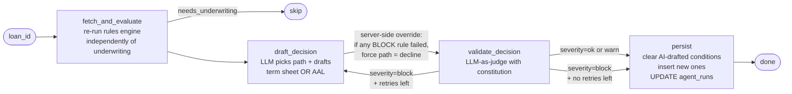
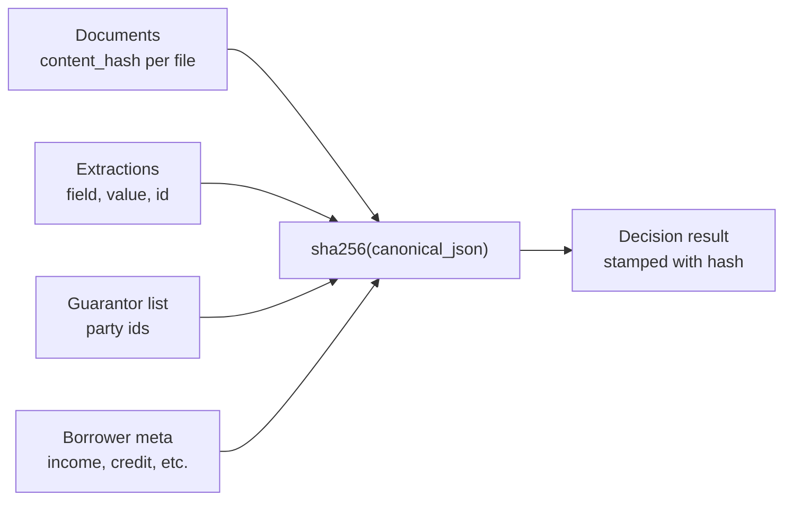

# Architecture

Mkopo is an LLM-augmented loan-origination system organised around three
constraints, in priority order:

1. **Every output must be auditable.** Each LLM action writes a row to
   ``llm_calls`` keyed by ``thread_id`` and ``parent_step_id``; each
   stage transition writes an ``audit_events`` row with a typed actor.
2. **The deterministic engine has final say.** A Python rules engine
   computes pass/fail outcomes independently of the LLM. The LLM
   composes prose around those outcomes; if it disagrees with the
   engine on a blocking outcome, the server overrides it.
3. **State changes are append-only and gated by a state machine.**
   ``services/loans.py``'s ``transition_stage`` is the only legal path
   from one ``LoanStage`` to another. Documents become immutable past
   ``conditions``; agents are refused past ``decision``.

Everything else — the agents, the UI, the autonomy mode — is a
consequence of those three.

---

## System overview

The API is stateless. Per-loan state lives in Postgres; per-agent-run
checkpoints live in Postgres via LangGraph's ``AsyncPostgresSaver``;
document bytes live in the configured storage backend. Redis is used
for JWT revocation + rate-limit token buckets only (auth degrades open
on Redis loss).

### Why these specific choices

- **Postgres for both relational state AND vector search** — pgvector is
  good enough for our corpus size and removes a system dependency.
- **LangGraph for agent state** — durable checkpointing across crashes
  + a clear node DAG for each agent. Worth more than the framework cost
  for the audit story.
- **Anthropic Claude** — schema-gated tool use + structured outputs are
  rigorous. The gateway abstraction (``llm_gateway.py``) is the only
  place the SDK is touched; swapping providers is one file.
- **SSE for agent streaming** — one-way, one-shot, plain HTTP. No
  WebSocket library, no reconnect logic. The graph emits one event per
  node completion.

---

## The three credit agents

Three independent LangGraph graphs, executed sequentially when the loan
is in autonomous mode. Each agent owns its own prompt, its own
structured output schema, and its own persist node.

Each agent's graph definition is one file under ``mkopo/agents/``.

### Sequential, not parallel — and why

The agents run sequentially because each depends on the prior's output:

- Underwriting needs accepted extractions to evaluate rules.
- Decision needs the underwriting summary + rule outcomes to pick a
  path.

Within a single agent, the inner nodes are also sequential — extract
→ identify-missing → draft-email is a linear chain. The one place
concurrency would pay off is the per-document extractor loop in
``intake.py``: today it runs documents serially via ``asyncio`` but in
a single chain. Parallel extraction is a clear next move; the schema
already supports it (each extraction row is independent).

The orchestrator (``agents/orchestrator.py``) calls
``maybe_chain_after_intake`` → ``maybe_chain_after_underwriting`` →
``_run_decision_agent`` in a single coroutine. There is no queue
between agents. At scale this should move to ``arq`` (already a
dependency) so that one slow underwriting run doesn't pin a request
worker; today the dev path is request-blocking, which is fine for the
demo's load profile.

### Autonomy mode

A loan carries an ``autonomy_level`` column (``assisted`` |
``autonomous``). The orchestrator is autonomy-gated at every hook:

- **Assisted** (default): the agent run completes, the orchestrator
  hook fires, sees the loan is assisted, returns. The underwriter
  clicks the next button manually.
- **Autonomous**: same hooks, but the orchestrator advances the stage +
  kicks the next agent. The chain stops at the next *irreversible*
  HITL gate (sending the intake email to the borrower, transmitting
  the decision letter). Those are real-world commitments where an
  undo isn't free.

The full autonomous flow on a clean-approve loan:

Verified end-to-end on a seeded loan: single ``POST /agents/intake/run``
cascades intake → underwriting → decision in one autonomous run; loan
ends in ``decision`` stage with ``risk_band=low`` and three completed
``agent_runs`` rows.

---

## State machine

Stage transitions are the only legal way ``loans.stage`` changes. The
edge set lives in ``models/loan.py`` (``VALID_TRANSITIONS``); every
edge is gated by both *edge legality* (the edge must exist) and
*prerequisites* (destination-specific checks in
``services/loans.py``).

Transitions require a free-text ``reason`` (≥3 chars) which lands on
the audit event payload. Backward transitions are not in the edge
set — once past a stage, the loan is committed to going forward, going
terminal, or being withdrawn.

---

## Stage locks

Three concentric zones, computed by ``services/loan_locks.py``:

| Zone | Stages | What's locked |
|---|---|---|
| Pre-decision | intake, underwriting, decision | Nothing — iteration window |
| Conditions clearance | conditions | Agents locked; doc upload still open (borrower may satisfy conditions) |
| Materials frozen | approved, closing | Both agents AND doc uploads locked |
| Terminal | servicing, declined, withdrawn | Read-only; only notes + owner reassignment allowed |

The server returns HTTP 409 on any locked operation. The frontend reads
the same policy via ``GET /loans/{id}/locks`` to disable buttons before
the click — same source of truth, two consumers.

---

## Per-agent design

### Intake

The HITL interrupt is a LangGraph ``interrupt()`` call. The graph
pauses, the SSE stream emits an ``interrupt`` event, the UI opens an
approval modal, and ``/agents/intake/resume`` calls
``Command(resume=...)`` to continue.

The extractor is in ``tools/extractor.py``. Per-document extraction
runs the LLM with a JSON schema specifying the target fields + their
types; each extraction includes a ``source_span`` (page + quote) and
a ``confidence`` (0..1). Below-threshold extractions land in
``review_tasks`` for human override.

### Underwriting

The cited summary is structured (``sections[]`` with ``title``,
``body``, ``citations[]``). Each citation is a field-name the LLM read
from the extractions; the frontend turns those into clickable chips
that resolve back to the source document quote via
``GET /loans/{id}/citations/{field_name}``.

### Decision

Two layered guardrails:

1. **Server-side path override**: ``decision.py`` evaluates rules
   independently. If ``has_blocking_failure(flags)`` is true, the
   LLM's chosen path is overwritten to ``decline`` regardless of
   what the model returned. Audit event
   ``decision_override_to_decline`` is written so the override is
   visible.

2. **Constitutional LLM-as-judge with Self-Refine loop**: the
   ``validate_decision`` node runs a separate LLM call against an
   explicit constitution (``agents/guardrails.py``). On
   block-severity failure, the LangGraph conditional edge routes
   back to ``draft_decision`` with the critique appended to the
   next prompt (Self-Refine, Madaan et al. 2023). Bounded by
   ``MAX_VALIDATION_ATTEMPTS = 3``. Pre-judge fast-fail via
   ``forbidden_substrings`` catches the common drift patterns
   (``[LENDER NAME]``, ``[DATE]``) without paying for the judge
   LLM round-trip.

See [SAFETY.md](SAFETY.md) for the full hallucination-mitigation
audit + how this implements Constitutional AI, LLM-as-Judge, and
Self-Refine from the literature.

---

## Materials hash — the decision-integrity story

Every decision is computed against a specific set of inputs:
documents, accepted extractions, borrower-supplied meta, and the
guarantor list. Those inputs change over time. If they change after a
decision is rendered, the decision is stale.

The hash is computed by ``services/materials_hash.py`` and stamped onto
``agent_runs.payload.materials_hash`` when the decision agent's
``persist`` node fires. The UI polls ``/loans/{id}/materials/status``;
when the current hash differs from the decision-time hash, the
``MaterialsFlow`` graph renders the four nodes in red and the
stage-transition guard refuses forward moves until the decision agent
is re-run.

This is *cryptographic decision integrity*: a regulator can verify
exactly what inputs produced a decision, and the system can detect
post-hoc tampering with no schema changes.

---

## Prompt registry + versioning

All system prompts live in ``services/prompts.py`` (the registry of
code defaults) and ``prompts`` (the DB table of versioned overrides).
The contract:

1. Every prompt has a ``DEFAULTS`` entry — source-controlled fallback.
2. The ``prompts`` table holds versioned bodies; exactly one row per
   identifier is marked ``is_active=True`` (partial unique index).
3. Process-cache is warmed at startup, refreshed after each edit.
4. Every ``llm_calls`` row stamps the ``prompt_version_id`` of the
   active row at call time (ContextVar set inside ``get()``, read by
   the gateway in ``_record_call``). This is the "which prompt
   produced this output" trail.
5. Edits flow through the staff ``/prompts`` page; a "Rewrite with AI"
   helper drafts a refined version against a brief; the underwriter
   reviews + activates.

---

## Observability

Three persisted streams, one read surface:

| Stream | Table | What it captures |
|---|---|---|
| LLM calls | ``llm_calls`` | model, system_prompt_hash, prompt_version_id, tokens, cost, latency, error_reason, error_detail, parent_step_id, thread_id |
| Agent runs | ``agent_runs``, ``agent_steps`` | per-run timing, status, full result JSON, per-node timing |
| Audit events | ``audit_events`` | typed actor, action, loan-scoped payload |

The ``/observability`` page surfaces all three with filters, sortable
columns, and drawer views. Tool invocations are persisted in
``tool_uses`` (one row per tool call inside an agent's chat loop).

---

## Eval harness

``evals/runner.py`` runs 12 labeled golden-set tasks (YAML in
``evals/golden_sets/``). The eval database table is ``task_runs``;
the dashboard is ``/eval``. Judge models are pinned across tasks
so trend lines aren't disrupted by model upgrades.

Three integrations between eval + production:

- A failing eval gates promotion of a prompt version (the "promote
  with eval" path exists; the gating is currently advisory).
- Review-queue overrides feed back into the drift_monitor: when a
  staff member overrides an LLM extraction, that's a signal the
  prompt is drifting and the eval surfaces it.
- Seven production-side monitors run nightly on the arq worker —
  drift, calibration, fairness (AIR), PSI on input features,
  refusal-rate spike, per-agent $/run + p95 latency, and
  embedding-distribution drift (MMD on prompts). Each writes
  ``task_runs`` rows so the dashboard's trend chart and per-card
  surfaces share one storage path.

**Running it**: ``cd api && uv run python -m evals.runner``. The
[README's "Eval suite" section](../README.md#eval-suite) lists the
current tasks + thresholds + the production monitors + the workflow
for adding a new task — kept there (not duplicated here) so the
command + task list stay in one place.

---

## Stack

| Layer | Choice |
|---|---|
| Backend | FastAPI 0.136, Uvicorn |
| ORM | SQLAlchemy 2.0 async + asyncpg |
| Migrations | Alembic |
| Database | PostgreSQL 16 + pgvector |
| Cache / rate-limit | Redis 7 |
| Agents | LangGraph 1.1 + langgraph-checkpoint-postgres |
| LLM | Anthropic Claude (Opus + Sonnet) via gateway abstraction |
| Embeddings | OpenAI text-embedding-3-small |
| Background jobs | arq |
| Email | Resend |
| Storage | Local FS or S3 (selected by ``STORAGE_BACKEND``) |
| Frontend | Next.js 16 (App Router), React 19, Tailwind v4 |
| Frontend data | TanStack Query, framer-motion |
| Auth (borrower) | JWT + bcrypt + magic links + re-auth challenge (Redis-backed `jti` revocation; chat-tool path also gated for irreversible actions) |
| Auth (staff) | JWT + bcrypt cookies (`mkopo_staff_session`, audience `mkopo-staff`, 12h TTL, per-`jti` Redis blacklist on logout) |

---

## Scalability

The shape that scales:

- **Stateless API workers**: every request reads loan state from
  Postgres + (optionally) writes to it. No in-process session
  affinity. Horizontal scale is `replicas=N`.
- **LangGraph checkpoints in Postgres**: an agent run that starts on
  worker A can resume on worker B. The HITL pause survives worker
  recycling.
- **One LLM gateway**: token accounting, retry, structured-output
  gating, prompt-version stamping all flow through
  ``llm_gateway.py``. Provider swap is one file.
- **Materials hash is computed on demand**: no schema migration to
  recompute the hash if the input set definition changes; just
  re-run the helper.

The shape that does NOT scale (and is the single biggest open
architectural debt):

- **The orchestrator runs inline.** Today
  ``maybe_chain_after_underwriting`` calls ``_run_decision_agent``
  inside the request's async stack. That works for the demo but
  pins a worker for the decision agent's full duration (typically
  10–30 seconds end-to-end). At scale this needs a queue —
  ``arq`` is already a dependency; the orchestrator hook would
  enqueue rather than await.

- **No multi-tenancy.** Single lender assumed. Adding ``tenant_id``
  later is painful; if you ever want multi-tenant SaaS, add it
  before scale.

- **No event bus.** Stage transitions + decision emissions are
  good fit for an outbox table → downstream consumers. Today they
  fan out via direct service calls.

---

## Cost + loop bounds

LLM cost in an agentic system goes wrong in one of three ways:
unbounded loops, retries that compound, or chains of agents that
each redo the prior's work. We mitigate each:

### Hard ceilings on every loop

There is no ``while True`` anywhere in ``mkopo/agents``. Every loop
is either a bounded ``for`` range or a LangGraph conditional-edge
cycle gated by an explicit attempt counter.

| Loop | Cap | Where | What happens at the cap |
|---|---|---|---|
| Chat tool-call rounds (borrower + staff) | 6 | ``tool_chat_loop.py:_MAX_ITERATIONS`` | Final response includes a "hit the safety cap" hint; tool calls stop |
| Decision validator → drafter Self-Refine loop | 3 attempts | ``guardrails.py:MAX_VALIDATION_ATTEMPTS`` | Persist the latest draft with ``guardrail_judgment`` audit so a reviewer sees the unresolved flag |
| LLM gateway schema-mismatch retry | 1 | ``llm_gateway.py:call_structured`` | Persistent failure lands as ``status="error"`` in ``llm_calls`` |
| Orchestrator chain (intake → underwriting → decision) | Fixed sequence | ``orchestrator.py`` | Not a loop; each hook is autonomy-gated and runs at most once per parent invocation |

### Worst-case LLM call counts per agent run

Computed from the agent DAGs + retry caps. Counts are upper
bounds — typical runs land at the lower end because the validator
usually passes on the first attempt and the chat loop rarely needs
all 6 rounds.

| Agent + path | Typical | Worst case |
|---|---|---|
| Intake (5 docs, no missing fields) | 5 extract + 0 draft = 5 | 5 extract + 1 missing-fields email draft = 6 |
| Underwriting | 1 (cited summary draft) | 1 (no retry today; constitution coverage is a follow-on) |
| Decision (approve path, validator passes) | 2 (path + term sheet) + 1 (verdict judge) = 3 | 3 attempts × (2 draft + 1 judge) = 9 |
| Decision (decline path, validator passes) | 2 (path + AAL) + 2 (verdict + AAL judges) = 4 | 3 attempts × (2 draft + 2 judges) = 12 |
| Borrower chat turn | 1–3 (one user turn + 0–2 tool rounds) | 6 (``_MAX_ITERATIONS``) |
| Staff chat turn | 1–3 | 6 |

### Cost visibility

Every LLM call writes a row to ``llm_calls`` with
``cost_input_usd`` + ``cost_output_usd`` (computed by
``services/pricing.py`` from the model name + token counts). The
observability page renders per-agent-run cost so a retry storm is
visible immediately. There is no per-loan cost cap today —
adding one is a one-line check inside ``LLMGateway._record_call``,
flagged in the production gaps below.

### Pre-judge fast-fail

The constitutional judge ALSO short-circuits via
``forbidden_substrings`` before paying for the judge LLM call. A
draft that leaks ``[LENDER NAME]`` (the common drift pattern) is
caught with zero round-trip cost; the loop-back fires immediately.

## Production gaps

This is a portfolio system. The following are not present and would
be table stakes for actual deployment at a lender:

- **SSO / SAML** for staff auth (today: cookie + JWT with
  bcrypt-hashed passwords; production wants federation +
  per-role audit of permission grants).
- **Real credit-bureau integration** (today: extracted from text via
  the LLM).
- **HMDA Reg C field capture** + annual LAR filing.
- **TRID disclosure clock-tracking** (LE, CD).
- **OFAC + BSA/CIP** screening.
- **Field-level encryption at rest** for PII (SSN, DOB, account
  numbers).
- **Multi-tenancy** + tenant-scoped queries everywhere.
- **Servicing handoff** (loan ends at funding in our state machine).
- **Per-loan cost cap** — observability shows cumulative cost but
  there's no hard ceiling that aborts a run if it exceeds budget.
  A one-line check inside ``LLMGateway._record_call`` against a
  per-loan or per-day total would be the right shape.

These are documented because honesty about what's missing is worth
more than glossing over it. See [SAFETY.md](SAFETY.md) for the
hallucination-mitigation story specifically.
