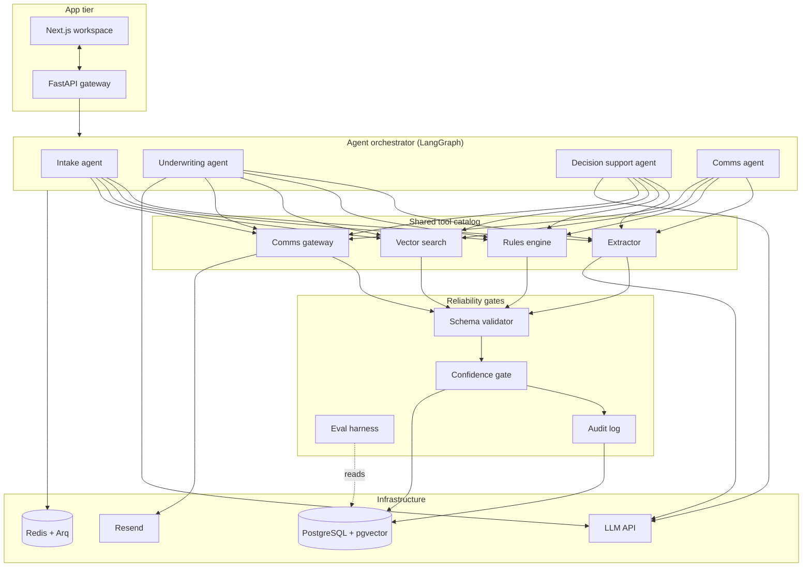
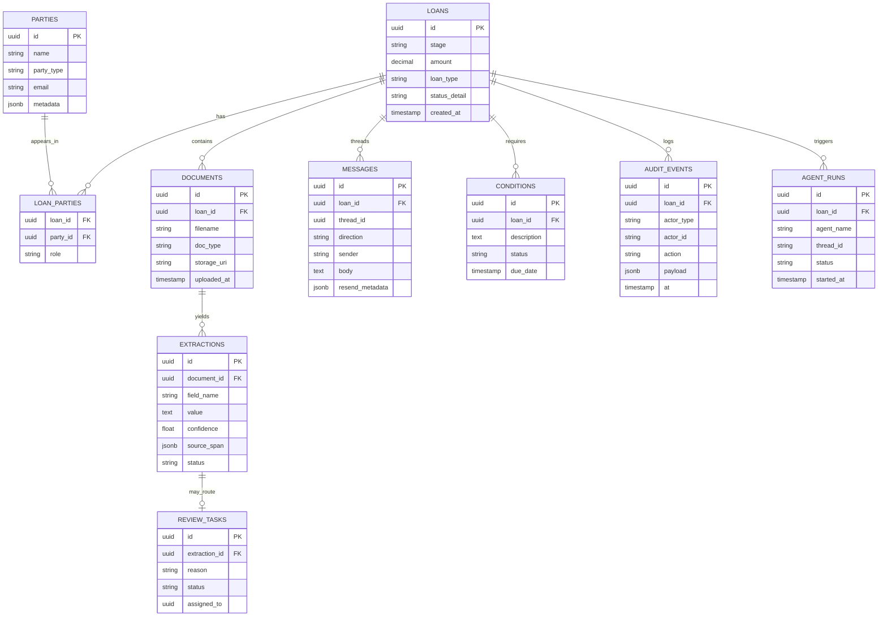
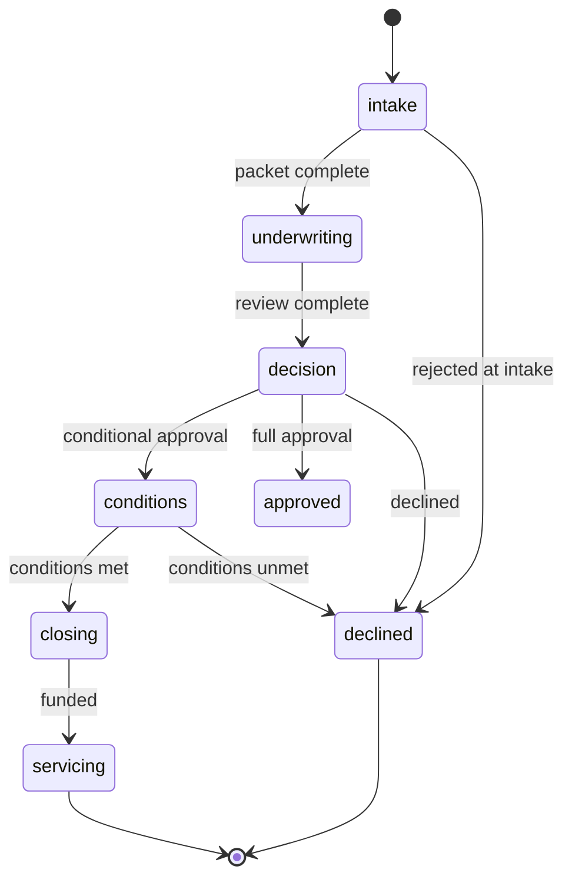
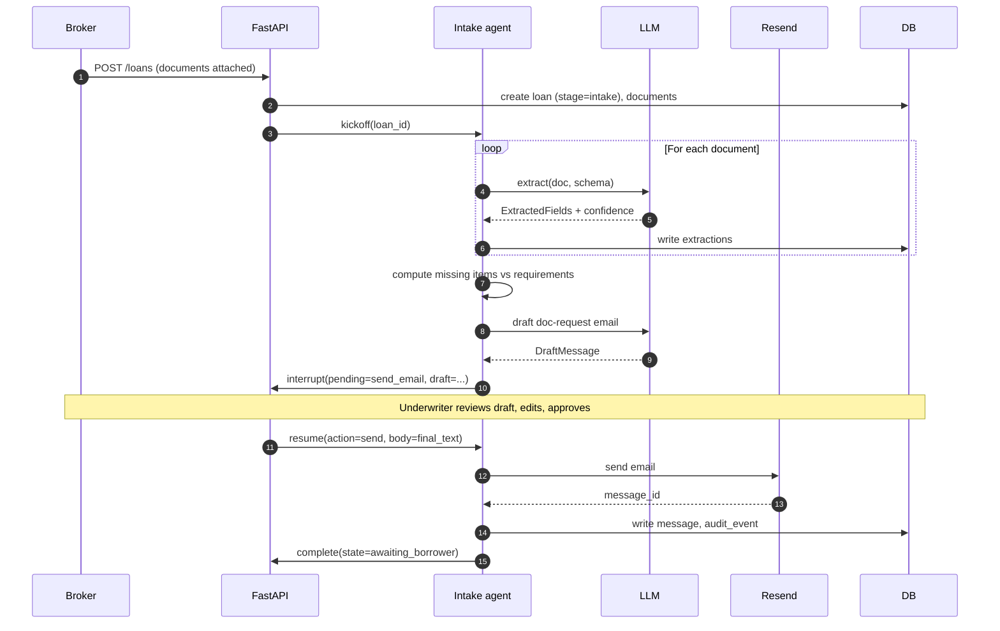
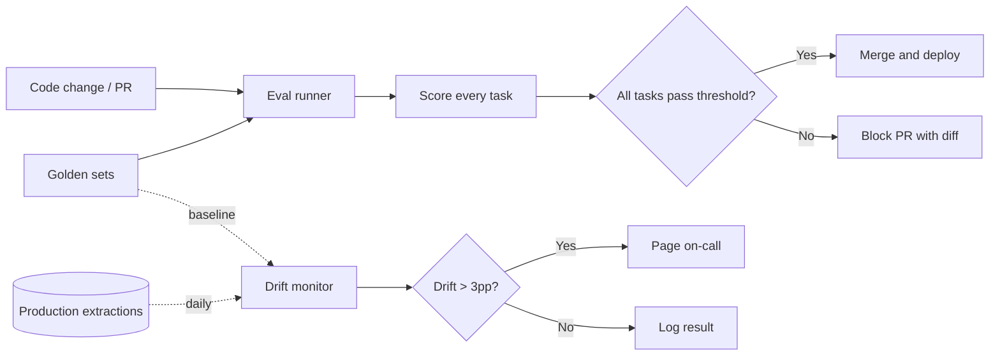
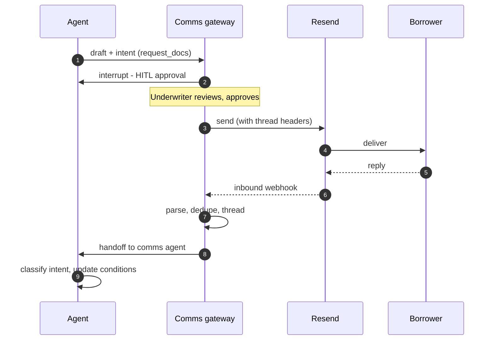

# Mkopo — Design

**Status:** Draft · v0.3
**Last updated:** May 2026
**Audience:** Engineers building, reviewing, or extending Mkopo. Familiarity with FastAPI, SQLAlchemy, and basic LLM tooling assumed; loan-specific terminology is glossed in §3.

---

## Table of contents

1. [Motivation](#1-motivation)
2. [Goals and non-goals](#2-goals-and-non-goals)
3. [Glossary](#3-glossary)
4. [System architecture](#4-system-architecture)
5. [Domain model](#5-domain-model)
6. [Agent architecture](#6-agent-architecture)
7. [Reliability architecture](#7-reliability-architecture)
8. [Communication workflow](#8-communication-workflow)
9. [Key tradeoffs](#9-key-tradeoffs)
10. [Open questions and future work](#10-open-questions-and-future-work)

---

## 1. Motivation

Private lenders — private money firms, CDFIs, tribal nations, universities, third-party servicers — operate in a niche that big-bank consumer-mortgage tooling does not serve well. Loan packets are heterogeneous, decisions are bespoke, and regulatory pressure is high enough that opacity is a deal-breaker. Existing software in this space (the incumbent being ABS / The Mortgage Office) is operationally excellent but pre-dates the generation of AI tooling that could plausibly do real underwriting work.

The opportunity is not "add a chatbot to loan origination." The opportunity is: build an AI-native origination system where every claim is sourced, every decision is auditable, and every error has a path to detection and correction. The buyer in this segment is a credit officer or compliance lead, not a growth marketer; the system has to earn their trust through visible mechanism, not vibes.

Mkopo is an attempt at that system, scoped to a portfolio demonstration.

## 2. Goals and non-goals

### Goals

- Demonstrate that an LLM-driven origination flow can produce auditable, defensible outputs by construction.
- Establish patterns that translate cleanly to a regulated production environment — typed contracts, immutable audit, evaluation in CI.
- Cover the full origination lifecycle end-to-end on synthetic data, from intake through decision and conditions-to-close.
- Be small enough that a single engineer can read the whole system in an afternoon.

### Non-goals

- Production-scale multi-tenancy, SSO, RBAC.
- Servicing (post-funding payments, escrow, default management). Origination ends at funding.
- Real borrower data. All examples are synthetic or drawn from public datasets.
- A novel agent framework. LangGraph is sufficient; we are not inventing one.
- Optimal cost. Where there is tension between clarity and minimal token spend, we choose clarity.

## 3. Glossary

| Term | Meaning |
|---|---|
| **LTV** | Loan-to-value. Principal divided by appraised value. Hard ceiling per policy. |
| **DSCR** | Debt service coverage ratio. NOI divided by annual debt service. >1.0 means the property's income covers its debt. |
| **NOI** | Net operating income. Rental income minus operating expenses, before debt service. |
| **Guarantor** | A person (usually the sponsor) who personally backs the loan if the borrowing entity fails to pay. |
| **Concentration** | Total exposure to a single guarantor across all active loans. Policy-limited. |
| **Bridge loan** | Short-term financing (6–36 months) used to acquire or reposition a property before permanent financing or sale. |
| **Term sheet** | A non-binding outline of loan terms issued before formal commitment. |
| **Conditions to close** | Items the borrower must satisfy before funding (updated appraisal, missing PFS, etc.). |
| **HITL** | Human-in-the-loop. A workflow that pauses AI execution for human approval. |
| **HMDA** | Home Mortgage Disclosure Act. Public dataset of mortgage applications, used here as synthetic-data ground truth. |

## 4. System architecture

Four logical tiers, each with a single responsibility.



**App tier.** A FastAPI gateway exposes REST endpoints for the Next.js frontend. SSE streams agent progress back to the UI when long-running operations are in flight. Authentication is a dev token in this version; a production deployment would substitute Clerk, Auth0, or a custom OAuth flow.

**Agent orchestrator.** LangGraph composes four agents (described in §6). Each agent is a subgraph with its own state, prompt, and tools. The orchestrator routes work based on a loan's current stage.

**Shared tool catalog.** All agents call the same four tools. This is intentional — keeping the tool surface small means each tool gets serious investment in correctness and observability, and agents stay composable.

**Reliability gates.** Every agent action passes through schema validation, confidence-based routing, and audit logging before reaching the database or the user. The eval harness reads from production data to detect drift and provides the regression-test gate in CI.

**Infrastructure.** PostgreSQL is the only persistent store for application data; pgvector handles embeddings. Redis is the Arq queue's broker. Resend is the email transport. The LLM API is currently Anthropic with a gateway abstraction that allows multi-provider routing later.

## 5. Domain model

### 5.1 Entity-relationship diagram



### 5.2 Loan as state machine

A loan moves through explicit stages. Transitions are operations on the loan service, not raw column updates, and each transition writes an audit event.



The transition function:

```python
async def transition_stage(
    loan_id: UUID,
    to_stage: LoanStage,
    actor: Actor,           # user or agent identity
    reason: str,
) -> None:
    async with session.begin():
        loan = await session.get(Loan, loan_id, with_for_update=True)
        validate_transition(loan.stage, to_stage)   # raises on illegal transitions
        loan.stage = to_stage
        await audit.record(
            loan_id=loan_id,
            actor=actor,
            action="stage_transition",
            payload={"from": loan.stage, "to": to_stage, "reason": reason},
        )
```

Centralizing transitions through one function is what makes the audit trail trustworthy. If any code path updates `loan.stage` directly, the audit guarantee breaks silently — so we make `Loan.stage` a property whose setter raises, and the only writer is the service.

### 5.3 Polymorphic parties

`parties` represents both persons (guarantors, sponsors) and entities (borrowing LLCs, trusts) in a single table, with `party_type` discriminating. The `loan_parties` join table carries the `role` (`borrower`, `guarantor`, `sponsor`, `broker`).

This design lets concentration analysis traverse the graph with one recursive CTE:

```sql
WITH active_loans AS (
    SELECT id, amount FROM loans
    WHERE stage IN ('underwriting', 'decision', 'conditions', 'closing', 'servicing')
)
SELECT
    p.id,
    p.name,
    SUM(l.amount) AS total_exposure,
    COUNT(*)     AS loan_count
FROM parties p
JOIN loan_parties lp ON lp.party_id = p.id
JOIN active_loans l   ON l.id        = lp.loan_id
WHERE lp.role = 'guarantor'
GROUP BY p.id, p.name
HAVING SUM(l.amount) > :concentration_threshold;
```

This single query powers the risk flag on the underwriting workspace, the entity inspector view, and the committee-escalation rule in the decision agent. Optimizing it (indexes on `loan_parties (party_id, role)` and `loans (stage)`) was a higher-leverage investment than adopting Neo4j.

## 6. Agent architecture

### 6.1 LangGraph composition

Each agent is a LangGraph subgraph with its own state, prompt template, and tool subset. The orchestrator is a top-level graph that routes by loan stage.

```python
from langgraph.graph import StateGraph
from langgraph.checkpoint.postgres import PostgresSaver

orchestrator = StateGraph(OrchestratorState)
orchestrator.add_node("intake",         intake_agent)
orchestrator.add_node("underwriting",   underwriting_agent)
orchestrator.add_node("decision",       decision_agent)
orchestrator.add_node("comms",          comms_agent)
orchestrator.add_conditional_edges("router", route_by_stage)
orchestrator.compile(checkpointer=PostgresSaver(connection_string))
```

The `PostgresSaver` checkpointer means every agent run is durable across crashes and deploys. A loan that pauses for a 3-day human review resumes seamlessly. The checkpoint tables (`checkpoints`, `checkpoint_writes`) live alongside the application schema and are tied back to application records via `agent_runs.thread_id`.

### 6.2 State design

Agent state is intentionally lean. It holds the working scratchpad — references, intermediate decisions, pending tool outputs — not full domain objects. Source of truth stays in the database.

```python
class IntakeState(TypedDict):
    loan_id: UUID
    extracted_fields: dict[str, ExtractedField]
    missing_fields: list[str]
    pending_action: PendingAction | None
    messages: list[BaseMessage]
```

A common anti-pattern is stuffing the full loan record into agent state. This creates two sources of truth and a synchronization problem. We pass `loan_id` and load the loan from the database whenever the agent needs it.

### 6.3 Intake agent — sequence



The `interrupt()` call before `Resend` is the critical guardrail. An agent that decides to send email autonomously is a future deliverability incident waiting to happen; an agent that drafts and pauses for confirmation is a productivity tool.

### 6.4 Agent catalog

| Agent | Triggered by | Outputs | Tools used |
|---|---|---|---|
| Intake | New loan submitted | Extracted fields, doc-request email (HITL) | Extractor, comms gateway |
| Underwriting | Packet complete, manual trigger | Underwriting summary with citations, risk flags | Extractor, rules engine, vector search |
| Decision support | Underwriter requests recommendation | Conditional approval recommendation, drafted conditions, term sheet draft | Rules engine, vector search |
| Comms | Inbound Resend webhook | Threaded reply, classified intent, auto-acknowledgment or escalation | Comms gateway |

### 6.5 Tool catalog

Each tool is a strongly-typed function with a Pydantic input and output schema. The agent declares its tools at graph compile time; LangGraph handles the call mechanics.

**Extractor.** Takes a document URI and a target schema; returns extracted fields with confidence and source spans. For this portfolio scope it operates on plain-text documents — a production build would run OCR first (e.g. Tesseract, pdfplumber, or a hosted OCR service). See §7.1.

**Rules engine.** Takes a loan_id and a rule pack identifier; returns a list of rule outcomes. Pure Python, no LLM. Each rule is a function with a docstring that doubles as documentation. Rules cannot be silently bypassed — adding a new policy is a code change in a reviewed PR.

**Vector search.** Takes a query (text or structured) and returns the top-k matching loans, properties, or entities. Uses pgvector with a `voyage-3` embedding model.

**Comms gateway.** Wraps Resend's API for outbound, parses Resend's inbound webhook for replies. Handles threading via `message_id` and `in_reply_to` headers. See §8.

## 7. Reliability architecture

### 7.1 Schema-gated LLM gateway

The single chokepoint for all LLM calls.

```python
class LLMGateway:
    async def call_structured(
        self,
        *,
        model: str,
        system: str,
        user: str,
        schema: type[T],
        max_retries: int = 2,
    ) -> T:
        for attempt in range(max_retries + 1):
            response = await self._client.messages.create(
                model=model,
                system=system,
                messages=[{"role": "user", "content": user}],
                response_format={"type": "json_schema", "schema": schema.model_json_schema()},
            )
            try:
                result = schema.model_validate_json(response.content[0].text)
                await self._audit(model, system, user, response, result, status="ok")
                return result
            except ValidationError as e:
                if attempt == max_retries:
                    await self._audit(model, system, user, response, None, status="failed")
                    raise
                user = self._build_correction_prompt(user, response, e)
```

Three properties this gives the system:

- **No free-form parsing anywhere.** Every output the agent consumes is typed.
- **Bounded retries.** The gateway will not loop forever trying to coax a valid response out of the model.
- **Universal audit.** Every LLM call — including failed ones — is logged with prompt, response, and outcome. This is the data the eval harness draws on for drift monitoring and the audit log surfaces for committee review.

### 7.2 Confidence gates

Extracted fields carry a confidence score. A per-field threshold (data, not code) determines routing:

| Field | Threshold | Rationale |
|---|---|---|
| `borrower_entity` | 0.95 | Simple, high-cost-of-error |
| `property_address` | 0.93 | Some normalization tolerance |
| `guarantor_list` | 0.90 | Set match, more variance |
| `annual_noi` | 0.92 | High-stakes financial input |
| `appraisal_date` | 0.85 | Often inferable from context |

Below threshold → write extraction with `status='queued_for_review'`, create a `review_tasks` row, surface in the human review queue. Above threshold → `status='accepted'`, agent proceeds.

Human corrections (`status='overridden'`) feed two places: the golden set (for eval) and a per-field "calibration log" used to tune thresholds quarterly.

### 7.3 Eval harness



Three task scoring paradigms cover everything in the system:

1. **Normalized string match.** Used for entity names, addresses. A `normalize()` function strips formatting variants; comparison is exact. Threshold typically 0.93–0.95.
2. **Numeric with tolerance.** Used for financial values. Compares relative error against a per-task tolerance (typically ±2%). Threshold typically 0.90.
3. **LLM-as-judge.** Used for free-form generation (summaries, drafted emails). A pinned, stronger judge model scores criteria on a 1–5 rubric. Hard floors on factuality prevent a hallucination from passing regardless of other criteria.

The judge model is pinned (`claude-opus-4-6` at time of writing) and never auto-upgraded. Changing the judge invalidates all historical scores; the cost-benefit of a judge upgrade has to be deliberate, not a side effect of a dependency bump.

### 7.4 Audit log

`audit_events` is the system's source of truth for "what happened." Append-only. Every state transition, every agent decision, every external send writes a row.

```python
class AuditEvent(BaseModel):
    loan_id: UUID
    actor_type: Literal["user", "agent", "system"]
    actor_id: str                       # user UUID, agent name, or "system"
    action: str                         # "stage_transition", "send_email", "extract_field", etc.
    payload: dict                       # action-specific JSON
    at: datetime
```

Three queries this enables:

- "Show me everything that happened on loan X." (`SELECT * WHERE loan_id = ? ORDER BY at`)
- "What did the AI do on this loan?" (`WHERE actor_type = 'agent'`)
- "Replay every email this loan ever sent." (`WHERE action = 'send_email'`)

This is the artifact that turns "the AI did something" into "the AI did exactly this at exactly this time with exactly this prompt and exactly this response." Committees and regulators want that artifact more than they want any individual feature.

### 7.5 Production drift monitoring

A nightly Arq job samples N=200 production extractions per task, joined to their human-reviewed ground truth (from the review queue), and computes the same scoring functions the eval harness uses. Results land in a `task_runs` table with a `source='production'` discriminator (vs `source='golden'`).

A 7-day rolling accuracy drop > 3 percentage points below the golden baseline pages the on-call. A separate signal — KL divergence between this week's input embeddings and the golden-set embedding distribution — alerts on input drift independent of model drift. The two together distinguish "the documents are getting weirder" from "the model is getting worse."

## 8. Communication workflow

The agent system is only as useful as its ability to drive a real conversation with a borrower. Mkopo treats inbound and outbound communication as first-class loan events.



### 8.1 Outbound

Every outbound email is composed by an agent, paused via `interrupt()`, surfaced to the underwriter for review, and only then sent. The `messages` table records the final body, the agent that drafted it, the user who approved it, and the Resend `message_id` for threading.

Headers: `Message-ID` and `In-Reply-To` follow standard RFC 5322 conventions. `Reply-To` points to a per-workspace inbox routed back through Resend's inbound webhook.

### 8.2 Inbound

Resend's inbound webhook posts the parsed email to `/webhooks/resend/inbound`. The handler:

1. Verifies the webhook signature.
2. Resolves the thread via `In-Reply-To` → `messages.thread_id`.
3. Writes the inbound `message` row.
4. Triggers the comms agent.

The comms agent classifies the reply: `attachment_provided`, `question`, `objection`, `out_of_office`, `unrelated`. Each classification has a downstream effect — attachments trigger re-extraction, questions route to the assigned underwriter, objections escalate.

Threading edge cases (forwarded chains, multiple `In-Reply-To` candidates, missing headers) are handled by a small set of deterministic rules, not the LLM. Threading is a place where LLMs hallucinate; we don't ask them to do it.

## 9. Key tradeoffs

| Decision | Chose | Rejected | Why |
|---|---|---|---|
| Graph database | PostgreSQL recursive CTEs | Neo4j | Concentration queries are 2–3 hops; CTEs are fast enough and avoid a second operational database. Revisit if traversals grow to 5+ hops or if pathfinding queries appear. |
| Model strategy | Frontier API via gateway, multi-model routing | Fine-tuning a smaller model | No production traffic to justify fine-tuning costs yet. Pre-trained + RAG + prompting clears the bar. Re-evaluate at >10M monthly tokens or on a customer's on-prem requirement. |
| Agent framework | LangGraph | Hand-rolled, CrewAI, AutoGen | Built-in durable state, native `interrupt()` for HITL, mature Postgres checkpointer. The state machine model fits how loans actually flow. |
| Email transport | Resend | Postmark, SendGrid | Cleaner inbound webhook API, modern DX, sufficient deliverability for the project. Postmark is also fine; SendGrid is overkill. |
| Document storage | Local filesystem | Object store (e.g. S3, GCS, R2) | Defer the cloud-storage abstraction until needed. The `documents.storage_uri` column is the swap point — switch the `StorageService` implementation without touching callers. |
| Frontend framework | Next.js App Router | Remix, plain React, SvelteKit | Largest community, best deploy story, server components for fast data-heavy views, what buyers expect. |
| Auth | Dev token (this version) | Clerk, Auth0, custom | Out of scope for a portfolio project. Wire-up point is FastAPI dependency `get_current_user`. |
| Background work | Arq | Celery, RQ, Dramatiq | Async-native (matches FastAPI), small surface area, sufficient features. Celery is overkill for the queue volume here. |
| Observability | OpenTelemetry + Phoenix | LangSmith, custom | Phoenix is open-source and self-hostable. LangSmith is the easier path if you're not allergic to a hosted dependency. |
| LLM judge | Pinned (`claude-opus-4-6`) | Auto-upgrade | Trend integrity. A judge upgrade invalidates historical scores and must be a deliberate, ratified change. |

## 10. Open questions and future work

**When to introduce a graph database.** Recursive CTEs handle the current query set well. If concentration analysis needs to traverse beyond direct guarantor → loan → property paths — for example, to detect related-party transactions across LLC structures — a graph database may pay for itself. Heuristic: if a single concentration query needs 5+ recursive levels and runs in >100ms p95, prototype the same query in Neo4j and compare.

**Fine-tuning trigger.** Two paths could justify a fine-tune. First, a customer with on-prem requirements (some CDFIs, some tribal-nation lenders) where a hosted API is non-starter. Second, sustained production traffic where a fine-tuned smaller model is materially cheaper than calling the frontier API at scale (>10M tokens/month is a reasonable inflection). The eval harness is the bridge — it lets you compare a fine-tune against the current model without subjective judgment.

**Multi-tenancy.** Out of scope for v1. The intended shape: every record is scoped to a `workspace_id`, all queries filter on it, and a workspace boundary is enforced at the FastAPI dependency level. Schema-per-tenant adds operational complexity that probably isn't warranted until per-tenant data segregation is a regulatory requirement.

**Closing and post-closing.** Mkopo stops at funding. A real lender needs closing-document generation (loan agreement, note, deed of trust, recording packet) and servicing handoff (the territory The Mortgage Office itself dominates). Either is a substantial extension; closing is the more natural next step.

**Multi-language support.** Synthetic loan packets are English-only. Real lenders increasingly handle borrower communications in Spanish, and some serve immigrant communities where Korean, Vietnamese, or Mandarin are common. The extraction pipeline is largely language-agnostic; the agent prompts and UI are not.

**Evaluation of agent behavior, not just task accuracy.** Current evals score individual tasks (extraction, summary, classification). They don't directly score *agent decisions* — for example, whether the intake agent correctly identifies missing items and drafts an appropriate request. Multi-turn agent evals are an open research area; the closest current pattern is scripted trajectories with a judge model evaluating the final state.

---

## Appendix A — References

- LangGraph documentation: <https://langchain-ai.github.io/langgraph/>
- HMDA public data: <https://www.consumerfinance.gov/data-research/hmda/>
- Freddie Mac SF Loan-Level Dataset: <https://www.freddiemac.com/research/datasets/sf-loanlevel-dataset>
- Resend API: <https://resend.com/docs>
- pgvector: <https://github.com/pgvector/pgvector>
