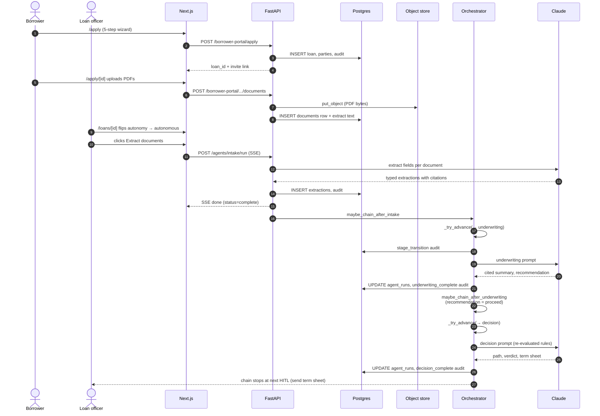
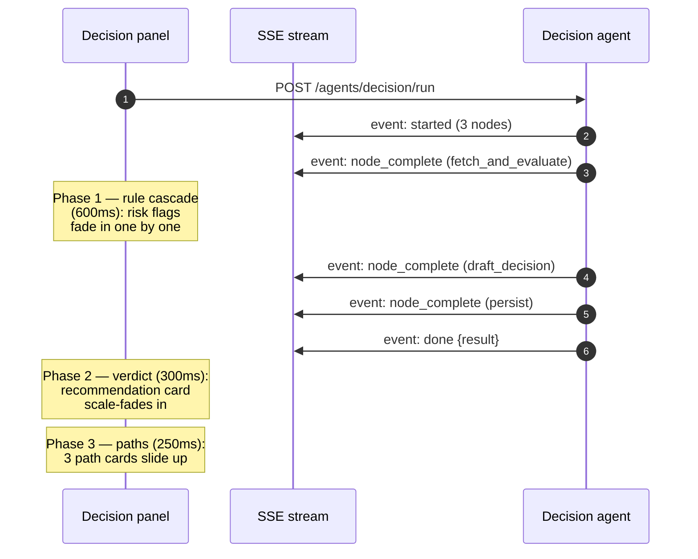
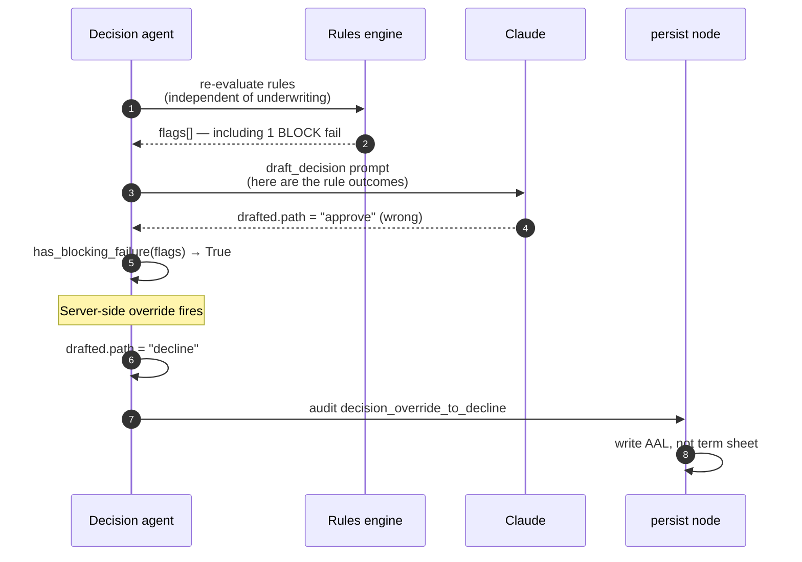
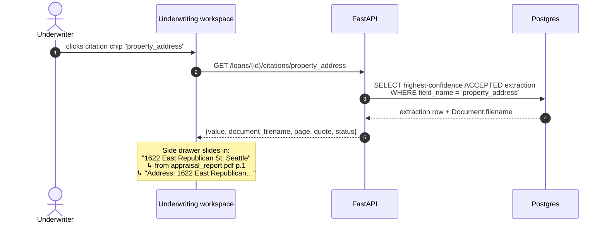
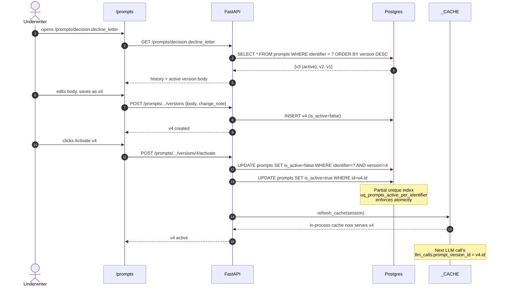

# Sample workflows

End-to-end traces of the most important flows. Every step in every
diagram corresponds to a real code path; nothing is aspirational.

For a fuller walkthrough you can click through in the running app,
see [TESTING_GUIDE.md](../TESTING_GUIDE.md).

---

## W1 · Borrower self-service application → autonomous decision

The full happy-path: a borrower applies, uploads documents, and a
loan officer flips autonomy on. The three agents chain on a single
click.



What the underwriter sees on the workspace:

- The phase nav highlights ``Decision`` because the chain advanced.
- The MaterialsFlow graph shows green ✓ (integrity verified).
- The verdict card displays the LLM's drafted approval text.
- Citations are clickable; each opens a side drawer with the source
  document quote.

---

## W2 · Decision verdict reveal cinematic

What the user actually sees when the decision agent finishes — staged
reveal so the deterministic-then-LLM separation is visible.



The cinematic plays once per fresh agent run (tracked by
``animatedRunId`` ref). Subsequent re-mounts of the same result skip
to ``done`` — no theatrical replay when the user has already seen the
verdict.

---

## W3 · Decision-time guard: rules engine overrides the model

The single most important guardrail. Even if the LLM picks
``approve``, the server forces ``decline`` if any blocking rule
failed.



The override is logged as ``decision_override_to_decline`` so an
auditor can see when the model and the engine disagreed. In practice
this fires rarely (well-tuned prompts respect rule outcomes), but
when it does fire it's the system catching a model error before it
becomes a borrower-visible decision.

---

## W4 · Materials drift detection

Decisions are stamped with a sha256 hash of the inputs that produced
them. When inputs change, forward stage transitions are blocked.

```mermaid
sequenceDiagram
    autonumber
    actor U as Underwriter
    participant FE as Loan detail
    participant API as FastAPI
    participant Hash as materials_hash
    participant DB as Postgres

    Note over DB: Decision agent ran;<br/>agent_runs.payload.materials_hash<br/>= "v1:abc123…"
    U->>FE: views loan
    FE->>API: GET /loans/{id}/materials/status
    API->>Hash: compute_materials_hash(loan_id)
    Hash->>DB: read docs + extractions + parties + meta
    Hash-->>API: current_hash = "v1:abc123…"
    API-->>FE: drifted = false
    Note over FE: MaterialsFlow shows green ✓
    Note over U: Underwriter accepts new extraction from review queue
    U->>FE: Accept extraction
    FE->>API: POST /review-tasks/{id}/accept
    API->>DB: update Extraction.status = ACCEPTED
    Note over DB: materials set has now changed
    U->>FE: tries to transition decision → approved
    FE->>API: POST /loans/{id}/transition
    API->>Hash: compute_materials_hash → "v1:def456…"
    Note over API: current_hash ≠ stamped_hash
    API-->>FE: 422 — materials drifted, re-run decision
    Note over FE: MaterialsFlow shows red ✗<br/>+ block on the affected edge
```

The drift signal is server-authoritative — the transition endpoint
runs the same check. The UI reflects the same source of truth.

---

## W5 · Borrower withdraws application (destructive HITL)

Sensitive operations require re-authentication even for the
borrower's own loan.

```mermaid
sequenceDiagram
    autonumber
    actor B as Borrower
    participant FE as /account
    participant API as FastAPI
    participant Redis

    B->>FE: clicks Withdraw on a loan
    FE->>B: confirmation modal<br/>"Re-enter password"
    B->>FE: enters password
    FE->>API: POST /borrower-auth/reauth {password}
    API->>API: verify against bcrypt hash
    API->>Redis: SET reauth:{jti} = ok TTL=300
    API-->>FE: 200
    FE->>API: POST /borrower-portal/loans/{id}/withdraw
    API->>Redis: GET reauth:{jti} → ok
    API->>API: services/loans.transition_stage(WITHDRAWN)
    API->>API: audit: loan_withdrawn (actor=borrower)
    API-->>FE: 200
    Note over FE: Loan now terminal;<br/>case file is read-only
```

The 5-minute re-auth window is enforced server-side. Same pattern is
used for data export and erasure requests.

---

## W6 · Citation hover → source document quote

The grounded-AI demo moment. Hover any citation chip in an
underwriting summary; the side drawer shows the exact document quote
the value came from.



The fallback path: PROPOSED extractions (low confidence) are returned
too, marked with the proposed status chip so the underwriter can see
the source even before signing off.

---

## W7 · Borrower chat — bounded by tool catalog

The borrower assistant is read-only by default; destructive ops fire
only through an explicit confirmation tool.

```mermaid
sequenceDiagram
    autonumber
    actor B as Borrower
    participant FE as Chat
    participant Loop as tool_chat_loop
    participant LLM as Claude
    participant Tools as borrower.py tools

    B->>FE: "What's missing on my application?"
    FE->>Loop: POST /borrower-chat/message
    Loop->>LLM: system + history + tool catalog
    LLM-->>Loop: tool_use: list_missing_fields
    Loop->>Tools: list_missing_fields(loan_id)
    Tools-->>Loop: ["personal_financial_statement", "rent_roll"]
    Loop->>LLM: tool_result
    LLM-->>Loop: text response<br/>"Two items: PFS + rent roll"
    Loop-->>FE: assistant message + tool_uses persisted
```

For destructive operations (withdraw, erasure) the LLM must first
invoke ``confirm_action`` which renders a confirmation UI; the
borrower types "yes" or "withdraw" before the actual mutation tool
fires.

---

## W8 · Prompt versioning + active-row swap

The prompt registry pattern. Every prompt has a code default + DB
rows; exactly one row per identifier is active at a time.



The partial unique index ``WHERE is_active = TRUE`` makes the
"exactly one active" invariant a database guarantee, not a code
convention. Concurrent activate calls produce a clean 409, not a
silent inconsistency.
